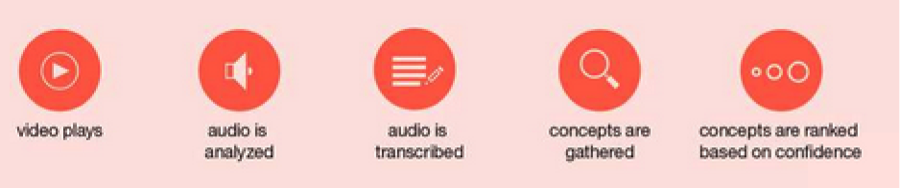

# Audio Analysis

This application is an **Application Starter Kit** (ASK) that is designed to get you up and running quickly with a common industry pattern, and to provide information about best practices around Watson services. The **Audio Analysis** application was created to highlight the combination of the [Speech to Text][speech_to_text] (STT) and [Concept Insights][concept_insights] services as an [Audio Analysis](#about-the-audio-analysis-pattern) tool. This application can serve as the basis for your own applications that follow that pattern.

Give it a try! Click the button below to fork the repository that contains the source code for this application into IBM DevOps Services, which then deploys your own copy of this application on Bluemix automatically:

[](https://bluemix.net/deploy?repository=https://github.com/watson-developer-cloud/audio-analysis-application-starter-kit/)

## Table of Contents
  - [How this app works](#how-this-app-works)
  - [Getting Started](#getting-started)
  - [Running the application locally](#running-the-application-locally)
  - [About the Audio Analysis pattern](#about-the-audio-analysis-pattern)
    - [When to use this pattern](#when-to-use-this-pattern)
    - [Best practices](#best-practices)
    - [Reference information](#reference-information)
      - [Speech to Text](#speech-to-text)
      - [Concept Insights](#concept-insights)
  - [User interface in this sample application](#user-interface-in-this-sample-application)
  - [Troubleshooting](#troubleshooting)

### How this app works
The Audio Analysis application creates a unique viewing and learning experience by providing real-time [TED][ted] video recommendations based on the articulated words of a specified YouTube video.

To begin, select or specify a YouTube video. As the video streams, the [Speech to Text][speech_to_text] service transcribes its audio track.  That text is then piped to the [Concept Insights][concept_insights] service for analysis. The Concept Insights maps input text to a concept graph that is based on the English language Wikipedia. The Concepts Insights service not only identifies explicit matches when a concept is directly mentioned, but also provides implicit matches to concepts that are related but not directly mentioned. When Concept Insights identifies a concept from the audio, it returns that concept and an associated confidence score.  The app then takes the top 3 extracted concepts (by confidence score) and searches for matching TED talks from transcripts of those talks.  The talks returned by the app either contain these concepts directly or contain closely related concepts.

## Getting started
The application is written in [Node.js](http://nodejs.org/) and uses [npm](https://www.npmjs.com/).  Instructions for downloading and installing these are included in the following procedure.

**Important:** If you used the `Deploy to Bluemix` button to deploy an instance of this application to Bluemix automatically, you will have to delete that application and the services that it used before you can build and deploy an application manually. You can use the `cf apps` command to see the instances of the Speech to Text and Concept Insights services that your application uses, use the `cf delete application-name` command to delete the application, and use the `cf delete-services service--name` command to delete each of the Speech to Text and Concept Insights service instances that the application used.

The following instructions explain how to [fork the project on GitHub](https://github.com/germanattanasio/movie-assistant#fork-destination-box) and push that fork to Bluemix using the `cf` command-line interface (CLI) for Cloud Foundry. If you want to run the application locally, see the next section, [Running the application locally](#running-the-application-locally):

  1. Log into GitHub and fork the project repository. Clone your fork to a folder on your local system and change to that folder.

  2. Create a Bluemix account. [Sign up][sign_up] in Bluemix or use an existing account. Watson services in beta are free to use, as are GA services in the standard plan below a certain usage threshold.

  3. If it is not already installed on your system, download and install the [Cloud-foundry CLI][cloud_foundry] tool.

  4. If it is not already installed on your system, install [Node.js](http://nodejs.org/). Installing Node.js will also install the `npm` command.

  <a name="step5"></a>
  5. Edit the `manifest.yml` file in the folder that contains your fork and replace `video-analysis` with a unique name for your copy of the application. The name that you specify determines the application's URL, such as `application-name.mybluemix.net`. The relevant portion of the `manifest.yml` file looks like the following:

    ```yml
    applications:
    - services:
      - speech-to-text-service
      - concept-insights-service
      name: application-name
      command: npm start
      path: .
      memory: 512M
    ```

  6. Connect to Bluemix by running the following commands in a terminal window:

	```sh
	$ cf api https://api.ng.bluemix.net
	$ cf login -u <your-Bluemix-ID> -p <your-Bluemix-password>
	```

  7. Create an instance of the Speech to Text in Bluemix by running the following command:

	```sh
	$ cf create-service speech_to_text standard speech-to-text-service
	```
    **Note:** You will see a message that states "Attention: The plan `standard` of service `speech_to_text` is not free.  The instance `speech-to-text-service` will incur a cost.  Contact your administrator if you think this is in error.". Transcription of the first 1000 minutes of audio per month to the Speech to Text service are free under the standard plan, so there will be no charge if you remain below this limit.

  8. Create the Concept Insights service:

	```sh
	$ cf create-service concept_insights standard concept-insights-service
	```
    **Note:** You will see a message that states "Attention: The plan `standard` of service `concept_insights` is not free.  The instance `concept-insights-service` will incur a cost.  Contact your administrator if you think this is in error.". The first 25,0000 API calls to the Concept Insights service are free under the standard plan, so there will be no charge if you remain below this limit.

  <a name="step9"></a>
  9. Push the updated application live by running the following command:

	```sh
	$ cf push
	```

See the [User interface in this sample application](#user-interface-in-the-sample-application) section for information about modifying the existing user interface to support other video sources.

## Running the application locally

First, make sure that you followed steps 1 through 9 in the [previous section](#getting-started) and that you are still logged in to Bluemix. Next:

  1. Create a `.env.js` file in the root directory of the project with the following content:

  ```js
module.exports = {
  VCAP_SERVICES: JSON.stringify({
	concept_insights: [{
	  credentials: {
		url: 'https://gateway.watsonplatform.net/concept-insights/api',
		username: ‘CONCEPT INSIGHTS NAME HERE’,
		password: ‘CONCEPT INSIGHTS PASSWORD HERE’
	  }
	}],
	speech_to_text: [{
	  credentials: {
		url: 'https://stream.watsonplatform.net/speech-to-text/api',
		username: ‘SPEECH TO TEXT NAME HERE’,
		password: ‘SPEECH TO TEXT PASSWORD HERE’
	  }
	}]
  }),
  VCAP_APP_PORT: 3000
};

  ```

  2. Copy the `username`, `password`, and `url` credentials from your `concept-insights-service` and `speech-to-text-service` services in Bluemix to the previous file. To see the service credentials for each of your service instances, run the following command, replacing `<application-name>` with the name of the application that you specified in your `manifest.yml` file:

	```sh
	$ cf env <application-name>
	```
   Your output should contain a section like the following:

	```sh
	System-Provided:
	{
	"VCAP_SERVICES": {
	  "concept_insights": [{
		"credentials": {
		  "url": "<url>",
		  "password": "<password>",
		  "username": "<username>"
		},
		"label": "concept_insights",
		"name": "concept-insights-service",
		"plan": "standard"
	 }]
	}
	}
	```

  3. Install any dependencies that a local version of your application requires:

	```sh
	$ npm install
	```

  4. Start the application by running:

	```sh
	$ node app.js
	```
  5. Open [http://localhost:5000](http://localhost:5000) to see the running application.


## About the Audio Analysis pattern

First, make sure you read the [Reference Information](#reference-information) to understand the services that are involved in this pattern.
The following image shows a flow diagram for spoken language analysis using the Speech-To-Text and Concept Insights services:

<p align="center">
  
</p>

### Using the Speech To Text and the Concept Insights services

When a quality audio signal contains terms found in Wikipedia (the current source of concepts in Concept Insights), the combination of Speech To Text and Concept Insights can be used to analyze the audio source to build summaries, indices, and to provide recommendations for additional related content. Though the Speech-To-Text service supports several languages, the Concept Insights service currently only supports English.

The Audio Analysis app uses the node.js Speech-To-Text JavaScript SDK, which is a client-side library for audio transcriptions from the Speech To Text service. It also uses the `annotate_text` and `conceptual_search` APIs from Concept Insights to extract concepts and provide content recommendations. In order to change the source of content for recommendations, the user should ingest the content of interest into the Concept Insights service using the API set under the prefix `/corpus`.

This app generates a new recommendation when it detects an existing concept from the streaming audio transcript. Typically, the app will be reasonably confident about the top 3 concepts after one to two minutes.  After the app is confident about the top 3 concepts, the recommendations will stabilize. One can make small modifications to the app to produce different behaviors.

Additional experiences can be created using these services. For example, the transcripts of multiple audio files can be added to a corpus in Concept Insights (using the API endpoint /corpus) to be used as the content source for recommendations. This in turn can be used to provide a "fuzzy" search function that is able to locate reference to a topic of interest. For example, a search for “algae” will locate those portions of a video where not only “algae” is mentioned, but also “coral reefs” and “biodiversity”.

### When to use this pattern

* You need to analyze or index content contained within speech.
* You want to make content recommendations based on speech.

### Best practices

* The quality of the audio source determines the quality of the transcript, which affects the quality of extracted concepts and recommendations.
* The quality and confidence of the extracted concepts increases with the amount of transcribed text.

### Reference information
The following links provide more information about the Concept Insights and Speech to Text services, including tutorials on using those services:

#### Concept Insights

* [API documentation](http://www.ibm.com/smarterplanet/us/en/ibmwatson/developercloud/doc/concept-insights/): Get an in-depth understanding of the Concept Insights service
* [API explorer](https://watson-api-explorer.mybluemix.net/apis/concept-insights-v2): Try out the REST API

#### Speech To Text

* [API documentation](http://www.ibm.com/smarterplanet/us/en/ibmwatson/developercloud/doc/speech-to-text/): Get an in-depth understanding of the Speech To Text service
* [API reference](http://www.ibm.com/smarterplanet/us/en/ibmwatson/developercloud/speech-to-text/api/v1/): SDK code examples and reference
* [API Explorer](https://watson-api-explorer.mybluemix.net/apis/speech-to-text-v1): Try out the API

## User interface in this sample application

The user interface that this sample application provides is intended as an example, and is not proposed as the user interface for your applications. However, if you want to use this user interface, you will want to modify the following files:

* `src/views/index.ejs` - Lists the YouTube videos and footer values that are shown on the demo application's landing page. These items are defined using string values that are set in the CSS for the application. (See the next bullet in this list.) By default, the items in the footer are placeholders for IBM-specific values because they are used in the running instance of this sample application. For example, the Terms and Conditions do not apply to your use of the source code, to which the [Apache license](#license) applies.
* `src/views/videoplay.js` - Maps YouTube video URLs to API calls and initiates streaming. You will want to expand or modify this if you want to use another video source or player.
* `src/index.sj` - Supports multiple types of YouTube URLs. You will want to expand or modify this if you want to use another video source or player.

## Troubleshooting

When troubleshooting your Bluemix app, the most useful source of information is the execution logs. To see them, run:

  ```sh
  $ cf logs <application-name> --recent
  ```

## Open Source @ IBM
  Find more open source projects on the [IBM GitHub Page](http://ibm.github.io/)

### License

  This sample code is licensed under the Apache 2.0 license. Full license text is available in [LICENSE](LICENSE).

### Contributing

  See [CONTRIBUTING](CONTRIBUTING.md).

[cloud_foundry]: https://github.com/cloudfoundry/cli
[sign_up]:https://console.ng.bluemix.net/registration/
[speech_to_text]: http://www.ibm.com/smarterplanet/us/en/ibmwatson/developercloud/speech-to-text.html
[concept_insights]: http://www.ibm.com/smarterplanet/us/en/ibmwatson/developercloud/concept-insights.html
[ted]: https://www.ted.com/about/our-organization
